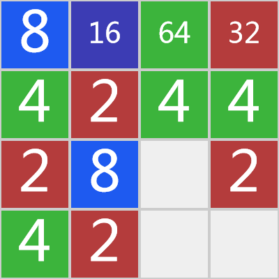

## 使用canvas绘制2048小游戏

通过2048游戏的特点，可以将绘制分为背景绘制和具体方块的绘制两部分。

### 背景绘制

由于背景是不变的，是用来被覆盖的，可以将背景用`Path2D`对象绘制出来，大致就是一个4x4的棋盘格子形状，然后每次移动的时候再直接载入到主canvas对象中，避免重复绘制；

### 方块对象

由于是4x4的格子，所以最多也就出现16个数字元素，所以可以直接将其放置到一个数组中，用数组的索引来表明其二维的位置即可；然后绘制的时候可以将位置和数字传入到封装好的对象中，构造一个可绘制的对象（包含绘制的具体位置，颜色，字体大小等等），遍历绘制即可；

### 移动的逻辑

以**向左移动**为例：由于左右是每行之间的元素进行合并，所以先对行进行遍历，再对每行的元素进行遍历；

0. 设定每行第一个元素为起始位置

1. 从起始位置后一位开始，将元素向前（根据移动而定，向左移动的前进方向就是左）进行移动，直到碰到一个非空元素或达到起始位置
2. 若移动后的元素位置位于起始位置元素之后，将移动后的当前元素与前一个元素进行比较，若两者数字相等则进行合并，**并将当前位置设为起始位置** （此步骤是为了避免合并后的元素再次被合并，显然违背游戏逻辑）
3. 下一个元素重复1和2

